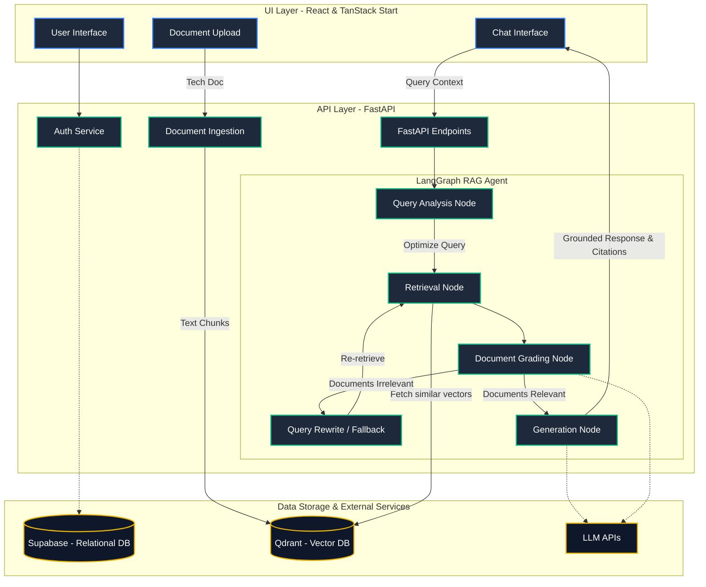

<div align="center">
  <h1 align="center">
    
  </h1>

  <p align="center">
    <strong>Self-Corrective LangGraph Workflow for Technical Document Analysis</strong>
  </p>

  <p align="center">
    
    
    
    
    
  </p>
</div>

<br />

## 🌟 Project Overview

**Exics AI** is a state-of-the-art Retrieval-Augmented Generation (RAG) platform designed to ingest, process, and query complex technical documentation. Built for developers and technical researchers, the system combines a **FastAPI** backend with a dynamic, self-corrective **LangGraph** orchestrator and a sleek **React** frontend. It ensures that users can converse with API references, framework guides, and code documentation without hallucination or context-bleeding.

### Key Features
- **Self-Corrective Agentic RAG**: Features query analysis, document retrieval, document grading, and robust fallback mechanisms via LangGraph.
- **Document-Aware Memory**: Strict per-chat document scoping ensures context doesn't bleed across different technical research sessions.
- **Real-Time UI**: TanStack Start + Tailwind frontend providing an app-like experience for uploading and chatting with technical PDFs or docs.
- **Persistent Vector Store**: High-performance semantic search powered by Qdrant and local SentenceTransformers.

---

## 🏗 System Architecture



---

## 📂 Project Structure

| Directory / Component | Description | Technologies |
| :--- | :--- | :--- |
| **`/src`** | Modern frontend UI allowing users to upload technical documents and chat with context. | React, TanStack Start, Tailwind, shadcn/ui |
| **`/backend/api`** | RESTful API endpoints for `/ingest`, `/query`, `/documents`, and `/feedback`. | FastAPI |
| **`/backend/graph`** | Stateful self-corrective workflow routing queries through analysis, retrieval, grading, and generation. | LangGraph, Langchain |
| **`/backend/services`**| Handlers for specific business logic: embeddings, vector DB, auth. | PyPDF2, SentenceTransformers |
| **`Qdrant`** | High-performance vector database to store and search technical document embeddings. | Qdrant Client |
| **`Supabase`** | PostgreSQL database for robust relational storage of users, chats, docs. | Supabase Client |

---

## 🚀 Setup Instructions

### Prerequisites
- **Python 3.10+**
- **Node.js 18+** & npm (or bun)
- **Supabase Account** (for PostgreSQL)
- **Qdrant** (Local or Cloud)

### Environment Variables
Create a `.env` file in the `/backend` directory:
```env
# Supabase
SUPABASE_URL=your_supabase_url
SUPABASE_KEY=your_supabase_key

# Database URL
DATABASE_URL=your_postgres_connection_string

# Qdrant
QDRANT_URL=your_qdrant_url
QDRANT_API_KEY=your_qdrant_key

# LLM Providers
GROQ_API_KEY=your_groq_api_key
OPENAI_API_KEY=your_openai_api_key
```

### Running the Application

#### 1. Start the Backend
```bash
cd backend
python -m venv venv
# Activate venv:
# Windows: venv\Scripts\activate
# Mac/Linux: source venv/bin/activate

pip install -r requirements.txt
uvicorn main:app --reload --port 8000
```

#### 2. Start the Frontend
```bash
# In the root directory
npm install
npm run dev
```

The application will be available at `http://localhost:5173`.

---

## 🔌 Example API Requests & Responses

### 1. Upload a Document for Ingestion
**Request:**
```http
POST /api/v1/ingest/upload
Content-Type: multipart/form-data

file: <python-docs.pdf>
chat_id: "uuid-of-current-chat"
```
**Response:**
```json
{
  "status": "success",
  "document_id": "doc-uuid-1234",
  "chunks_processed": 45
}
```

### 2. Query the RAG Pipeline
**Request:**
```http
POST /api/v1/query
Content-Type: application/json

{
  "message": "How does LangGraph's StateGraph handle conditional edges?",
  "chat_id": "uuid-of-current-chat",
  "doc_ids": ["doc-uuid-1234"]
}
```
**Response:**
```json
{
  "reply": "In LangGraph, conditional edges are used to route the flow of execution based on dynamic conditions. For instance, you can use a document grading node to evaluate the context. If relevant, the graph routes to the Generation node; if not, it triggers a query rewrite.",
  "sources": [
    {
      "page": 2,
      "snippet": "...conditional edge that routes based on the document grading outcome..."
    }
  ]
}
```

---

## 🧠 Thought Process & Write-Up

### Architecture & Workflow Reasoning
The system implements a **self-corrective LangGraph pipeline** specifically designed to eliminate hallucination in technical queries. Standard sequential chains fail when initial retrieval is poor. By using an agentic graph with a dedicated **Document Grading Node**, the system can actively evaluate its own context. If the retrieved technical chunks are irrelevant, it triggers conditional edges to rewrite the query and try again, ensuring high-fidelity answers.

### Chunking & Embedding Strategy Choices
- **Strategy**: `RecursiveCharacterTextSplitter` with a chunk size of `1000` tokens and an overlap of `200` tokens.
- **Reasoning**: Technical documentation often contains long code blocks or complex API parameters that shouldn't be split aggressively. A 1000-chunk size ensures code snippets and their accompanying explanations remain intact within the same chunk. The 200 overlap prevents crucial boundary context (like function signatures) from being lost.
- **Embeddings**: Local `sentence-transformers` via HuggingFace were chosen to provide fast, cost-effective embeddings without hitting API rate limits during large document ingestions. 

### Design Decisions & Tradeoffs
1. **Per-Chat Document Scoping vs. Global Knowledge Base**: Documents are explicitly linked to specific chat sessions (`chat_documents` junction table). *Tradeoff*: You cannot easily query across all uploaded documents simultaneously, but this guarantees absolute isolation—preventing the LLM from confusing the API syntax of one framework with another.
2. **PostgreSQL + Qdrant Separation**: Relational metadata (users, chats) is stored in Supabase, while vector embeddings live in Qdrant. This plays to the strengths of both databases rather than forcing vector search onto standard PostgreSQL.

### Document Corpus
The application is capable of processing any technical PDF documentation via the frontend UI. For this assignment, standard technical manuals (like LangGraph API documentation) can be directly uploaded to test the self-corrective capabilities.

### Future Improvements
- **Hybrid Search**: Implementing Sparse-Dense hybrid search (e.g., BM25 + Vector) in Qdrant. This is crucial for technical docs where exact keyword matching (like `get_state()`) is often more important than semantic similarity.
- **Advanced OCR for Code**: Better handling of code blocks inside PDFs, possibly switching from PyPDF2 to a markdown-native parser like LlamaParse.

<br />

<div align="center">
  <i>Built with dedication for Exics AI.</i>
</div>
